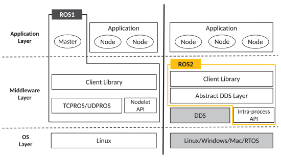
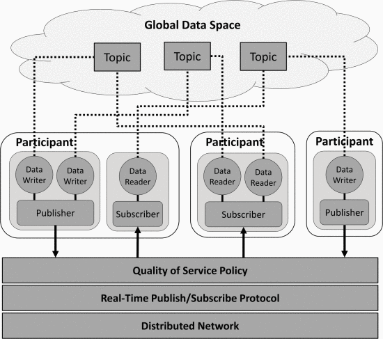
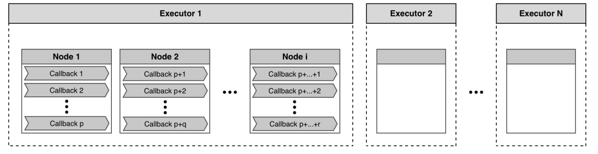
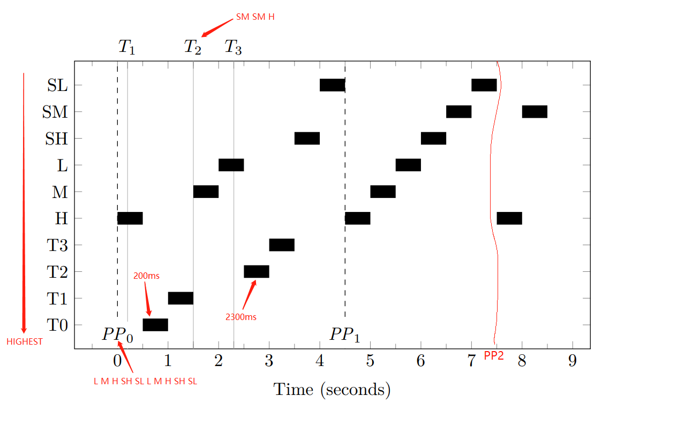

# 动脑实验03---ROS2中的实时协作问题研究
## 问题叙述
​	相比于ROS1，ROS2对实时应用给予了更大的关注。研究在ROS的实时应用场景中如何有效处理多个组件的协调和同步。

## ROS背景概述

​	Robot Operating System是一种开源的机器人操作系统，它的主要目标是在机器人研发领域中支持代码的复用。但是由于一些设计以及架构的问题不能满足需求的功能日益增加，开发者基于ROS1重新开发了ROS2。

## ROS2架构变化

​	ROS1使用的是一种分布式处理框架(Nodes), 并依赖于一个ROS Master的通信机制实现了机器人的各个组件的信息交换以及功能调用。为了支持实时应用，在升级到ROS2的过程中移除了ROS1仅主要支持TCP并且依赖ROS Master处理的通讯系统而使用了分布式的DDS(Data Distribution Service)来作为它的通讯系统以及根据QoS(Quality of Service)策略来保证进程之间的数据传输。这是因为ROS1中的节点需要在ROS Master进行注册然后通过RPC协议使各个节点相互定位才能建立一个对等的通信，所以如果一旦ROS Master出错就会导致整个通信系统的异常。另外这里还引入了Executor(rcl)的概念来支持执行管理和确保实时性能。

## DDS&Discovery

​	DDS是基于数据为核心的发布/订阅(DCPS)的模型，所以提供了一个可供所有独立应用访问的"Global Data Space"让ROS中所有的节点可以通过一个类型化的接口读取和写入这个数据空间。并且所有的DCPS实体都有一个QoS策略, 每次的数据传输由不同的QoS策略在不同的粒度等级来配置。从而使得进程之间达到一个高效的数据传输。

另外基于DDS的ROS2通讯系统还包括了以下几个概念：

- Domain Particinant: 作为后面几种实体的容器以及服务的入口, 并且在DDS中所有的应用通信必须在同一个Domain中。
- Publisher: 数据发送方, 管理一个或多个data writers。
- Subscriber: 数据接收方, 代表一个或多个data readers。
- DataWriter: 参与者使用data writer通过publisher发布指定类型的数据。
- DataReader: 与data writer类似用于接受对应data writer类型数据。
- Topic: 识别data writer和data reader之间的数据对象。

​	因为ROS2中移除了ROS Master所以通过一个Discovery的机制来建立节点之间的通信连接。Discovery使用底层的中间件自动实现的，就如上文中所说的，当一个节点启动时它会向相同Domain中的其他节点通知它的上线。节点也会用自身的信息响应这个通知以建立通信连接，并且节点也会定期报告它们的存在便于与新加入的节点建立连接。最后节点离线时也会通告。

## Nodes

​	ROS2中的应用程序是由多个节点作为独立执行运算的进程组成，节点之间可以组成ROS Graph来同时处理数据，每一个节点负责控制一个组件同时每一个节点都可以收发数据从其他节点，然后节点通过激活callbacks来处理每一个传入的信息。

​	节点之间的通信方式主要分为了Topic(Publisher-Subscriber), Services(Call-And-Response)和Action(Client-Server)三种。其中Topic是最常见的，Topic是一种单向通信充当节点之间交换消息的总线然后每一个节点都可以向多个Topic发送数据也同时可以订阅多个Topic。而Service是一种双向通信，当客户端调用时才会提供数据服务端处理请求并做出响应。最后的Action，它是基于topic衍生的适用于长时间运行且要实时反馈的动作。

## Executors&调度机制

​	上图中的是一个ROS2应用模型，ROS2将可执行代码装入Callbacks中同时一个节点中可能包含多个Callbacks。最后节点将被封装进Executors中形成一组可执行文件，当它们同时执行时就代表了一个完整的应用程序运行。默认的情况下程序是以单线程工作，通常回调函数会在DDS中按注册的顺序形成队列然后线程就会按一个FIFO的顺序处理，所以这应该是属于一种非抢占式的调度。但其实当回调的处理时间略长时，将会以这里从高到低的一个优先级处理：

- Timer
- Topic
- Service
- Client

​	并且ROS是基于一个等待集(Ready Set)来决定执行的程序，当Executor空闲时将会阻塞，并将更新它的等待集通过搜索之前说的这四种回调来寻找要执行的回调，它会按顺序评估并分配不同的优先级。而同一个队列中回调实例将会按注册顺序执行。

​	所以每当一个类别至少有一个回调就绪时，最高优先级的将会被执行然后移出等待集，而等待集为空更新就是一个轮询点，两个轮询点之间的间隔就是处理窗口，所有处理窗口间到达的信息只能在下一个轮询点处理。

​	然后从这里的是一个ROS2调度例子，首先它Y轴是优先级是一个从高到低的排序。在第一个轮询点发送了一个消息序列这里它将每个回调的一个实例放入等待集中，所以后半的消息序列需要等待第二个轮询点。并且这里分别在200ms和2300ms设置了两个timer。这里首先会执行H，另外因为timer有最高的优先级所以设置在200ms的两个timer会优先于M执行。另外在T2时间点又加入了新的消息序列，但是它们不能够加入这个处理窗口的等待集。所以在第二个轮询点剩下的实例才将会在处理窗口执行。

## 总结

## 参考资料

[1] Charles Randolph. Improving the Predictability of Event Chains in ROS 2. Delft University of Technology

[2] Yuqing Yang, Takuya Azumi. Exploring Real-Time Executor on ROS 2. IEEE

[3] Yuya Maruyama, Shinpei Kato, Takuya Azumi. Exploring the Performance of ROS2. IEEE

[4] Casini, Daniel & Blaß, Tobias & Lütkebohle, Ingo & Brandenburg, Björn. Response-Time Analysis of ROS 2 Processing Chains Under Reservation-Based Scheduling. 10.4230/LIPIcs.ECRTS.2019.6. 

[5] https://docs.ros.org/en/galactic/Tutorials/Understanding-ROS2-Nodes.html

